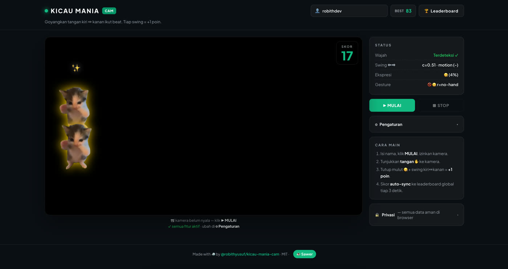

# 🐦 Kicau Mania Cam

**Game gestural berbasis kamera** yang sinkron ke lagu **Kicau Mania** (Ndarboy Genk x Banditoz Yaow 86) viral di TikTok. Goyangkan tangan kiri↔kanan ikut beat → dapat poin → masuk leaderboard global realtime. Kucing greenscreen joget + lirik karaoke pop sesuai beat.

🌐 **Live:** [kicaumania.online](https://kicaumania.online) · 📦 [GitHub](https://github.com/RobithYusuf/kicau-mania-cam) · ☕ [Sawer](https://saweria.co/robithyusuf)



---

## 🚀 Tech Stack

<a href="https://skillicons.dev">
  
</a>

<p>
  
  &nbsp;
  
</p>


---

## ✨ Fitur

- 📹 **Face & hand tracking** di browser (face-api.js + MediaPipe Hands, no server)
- 🎤 **Lirik karaoke** sync per word ke `audio.currentTime` via parser LRC standar
- 🎵 **Beat-aware visuals**: kucing greenscreen (chroma-key), JJ shake/flash, lyric pop animation
- 💚 **+1 per swing** kiri↔kanan, presisi via centroid-based Schmitt trigger
- 🏆 **Global leaderboard realtime** (Supabase, hashed IP, rate-limited 10/min)
- ⚙ **Toggle fitur** (kamera/lirik/kucing/JJ/musik) persisted di localStorage
- 🎶 **Seamless audio loop** via Web Audio `AudioBufferSourceNode` (sample-accurate)
- 📱 **Mobile-responsive**

---

## 🏗 Architecture

```
┌──── Browser (no backend) ─────────────────────┐
│                                               │
│  Camera ──► face-api.js (face + landmarks)    │
│         └► MediaPipe Hands (21 landmarks)     │
│         └► Frame-diff (motion centroid)       │
│                                               │
│  ┌────► Gesture Engine (mouth + hand swing)   │
│  └─────► +1 score per swing kiri↔kanan        │
│                                               │
│  Audio ──► Web Audio AudioBufferSource        │
│        └► Analyser FFT → bass beat detect     │
│        └► LRC timeline → lyric subtitle pop   │
│                                               │
│  Render ─► Canvas overlay: cats + lyric + JJ  │
│                                               │
└────────────┬──────────────────────────────────┘
             │ submit_score(name, score) RPC
             ▼
        ┌─────────────────────────────┐
        │  Supabase (Postgres + RT)   │
        │  - hashed IP (SHA-256)      │
        │  - RLS + rate limit         │
        │  - realtime broadcast       │
        └─────────────────────────────┘
```

---

## 🚦 Quick Start

### 1. Clone + install
```bash
git clone https://github.com/RobithYusuf/kicau-mania-cam.git
cd kicau-mania-cam
npm install
```

### 2. Download audio (hak cipta — tidak ter-bundle)
```bash
bash scripts/download-audio.sh
```
Butuh `yt-dlp` + `ffmpeg`: `brew install yt-dlp ffmpeg`

### 3. Setup env (opsional, untuk global leaderboard)
```bash
cp .env.example .env.local
# isi VITE_SUPABASE_URL + VITE_SUPABASE_ANON_KEY
# (lihat docs/MAINTENANCE.md untuk SQL migration)
```

### 4. Run
```bash
npm run dev
# buka http://localhost:8080 → klik MULAI → izinkan kamera
```

### 5. Build & deploy
```bash
npm run build      # output di dist/
# Vercel: tinggal push ke GitHub → auto-deploy
```

---

## 🎮 Cara Main

1. Isi nama, klik **▶ MULAI**, izinkan kamera.
2. Tunjukkan **tangan ✋** ke kamera.
3. **Tutup mulut 🤐** + swing tangan **kiri ↔ kanan** ikut beat.
4. Tiap swing = **+1 poin**.
5. Klik **■ STOP** → skor masuk leaderboard global.

---

## 📂 Struktur Project

```
kicau-mania-cam/
├── 📄 README.md
├── 📄 LICENSE
├── 📁 docs/
│   ├── MAINTENANCE.md        ← Supabase setup + admin
│   └── img/hero.jpg
├── 📁 scripts/
│   └── download-audio.sh
├── 📁 src/
│   ├── style.css              ← Tailwind v4
│   ├── main.ts
│   ├── state.ts
│   ├── types.ts
│   ├── audio/{buffer-player,beat,lrc}.ts
│   ├── tracking/{face,hands,motion}.ts
│   ├── render/{chroma,particles,effects}.ts
│   └── leaderboard/{modal,supabase}.ts
├── 📁 public/
│   ├── audio/{kicau-mania.mp3,kicau-mania.lrc}
│   ├── assets/cat-dance.mp4
│   └── models/                ← face-api weights
├── index.html
├── package.json
├── tsconfig.json
├── vite.config.ts
└── vercel.json                ← security headers
```

---

## 🔒 Security & Privacy

| Aspek | Implementasi |
|---|---|
| Camera footage | ❌ NEVER uploaded — semua processing in-browser |
| User IP | ✅ Hashed SHA-256 + salt sebelum disimpan ke DB |
| Score validation | ✅ Server-side: range 0–5000, client throttle 3s |
| Name validation | ✅ Regex `^[A-Za-z0-9_\- .]{1,20}$` (anti-XSS) |
| Rate limit | ✅ 10 submit/menit/IP via SQL function |
| RLS policies | ✅ Anon hanya SELECT + RPC call |
| Headers | ✅ HSTS + CSP + X-Frame-Options via `vercel.json` |
| HTTPS | ✅ Auto via Vercel/Cloudflare |

Detail lengkap: [docs/MAINTENANCE.md](docs/MAINTENANCE.md)

---

## 🤝 Kontribusi

Issue & PR welcome. Untuk perubahan besar, buka issue dulu untuk diskusi.

---

## 📜 Lisensi

- **Code**: [MIT](LICENSE)
- **Audio "Kicau Mania"**: hak cipta Ndarboy Genk x Banditoz Yaow 86 — bundle di repo cuma untuk demo lokal, JANGAN redistribusi komersial.

---

## ☕ Dukung

Kalau project ini berguna, traktir kopi: **[saweria.co/robithyusuf](https://saweria.co/robithyusuf)** 🙏

Made with 🐦 by [@robithyusuf](https://github.com/RobithYusuf)
